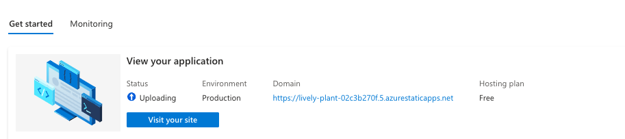

This is the Contoso Outdoors Company Website shown at Microsoft Ignite. It uses assets created by DALLE-3 and GPT-4. It is built with Next.js and Tailwind CSS.

## 1. Deploy on Azure Static Web Aps

The [original repository](https://github.com/Azure-Samples/contoso-web) was adapted to make these changes:
 - Add support for devcontainer (to launch in GitHub Codespaces)
 - Resize images (to fit within Azure Static Web Apps free tier)
 - Add Azure Static Web Apps GH Action (for automated deployment)
 - Add support for Node Engine (specific version needed)

In this version, we'll add support for [configuring repo for redeploy on demand](https://learn.microsoft.com/en-us/azure/static-web-apps/static-web-apps-cli-deploy#deploy-using-a-configuration-file) using Azure Static Web Apps CLI (`swa cli`). This allows learners to deploy a version of this app on demand, then update deployments from command-line (vs. GitHub Action). We can also use `swa cli` to explore local development in future. **The process involves 4 steps:**

1. [Install](https://learn.microsoft.com/azure/static-web-apps/static-web-apps-cli-install) SWA CLI
1. [Initialize](https://learn.microsoft.com/azure/static-web-apps/static-web-apps-cli-configuration#initialize-a-configuration-file) a Configuration File
1. [Acquire](https://learn.microsoft.com/en-us/azure/static-web-apps/static-web-apps-cli-deploy#deployment-token) a deployment token
1. [Deploy](https://learn.microsoft.com/en-us/azure/static-web-apps/static-web-apps-cli-deploy#deploy-using-a-configuration-file) the SWA to Azure

Let's see this in action:

```bash
# Install SWA 
npm install -g @azure/static-web-apps-cli

# Validate Install
swa --version
1.1.7

# Initialize a Configuration File (will guess settings)
swa init
Configuration successfully saved to swa-cli.config.json.

# Run app locally
swa start

# Build static app
swa build

# Do the first install manually to set up resources
# This requires Azure CLI (devcontainer has built-in support)
az --version
azure-cli 2.59.0

# Set parameters
export RANDOM_ID="$(openssl rand -hex 3)"
export MY_RESOURCE_GROUP_NAME="contoso-web-rg-$RANDOM_ID"
export REGION=EastUS2
export MY_STATIC_WEB_APP_NAME="contoso-web-swa"

# Log into Azure and select correct subscription
az login --use-device-code
az account set --subscription <subscription-id>

## Verify settings
az account show

# Create Resource Group
az group create --name $MY_RESOURCE_GROUP_NAME --location $REGION

# Deploy this static web app the first time
az staticwebapp create --name $MY_STATIC_WEB_APP_NAME --resource-group $MY_RESOURCE_GROUP_NAME --location $REGION 

# Get deployed URL
az staticwebapp show --name  $MY_STATIC_WEB_APP_NAME --resource-group $MY_RESOURCE_GROUP_NAME --query "defaultHostname" -o tsv

# Get the deployment token from SWA - Overview - Manage deployment token
export DEPLOYMENT_TOKEN=<deployment-token>

# Future deploys are now simpler
swa deploy --deployment-token $DEPLOYMENT_TOKEN  --env production
Deploying to environment: production
Deploying project to Azure Static Web Apps...
⠧ Status: InProgress. Time: ...

# This takes a while given there are many images to upload along with code
# Just wait ...
✖ Deployment Failed :(
✖ Deployment Failure Reason: Web app warm up timed out. Please try again later.

```

If you visit the Azure Portal and look up the Azure Resource Group you created, you should have a single SWA resource. Visiting the resource page, you should see the status of the application as _Uploading_. Wait till done then visit the associated URL to see the live site preview.



---

## 2. Preview App Locally

Run the default Next.js dev server to view the app:

```bash
npm run dev
```

Open the default preview URL [http://localhost:3000](http://localhost:3000) and you should see:


---

## 3. Use The App

Click on the chat button indicated above to start a chat session. There are three different chat types you can try:

- Regular Chat using prompt flow (you can set that up using the  [Contoso Chat](https://github.com/Azure-Samples/contoso-chat/) repo). This is the default chat type.
- Grounded chat using the "Add Your Data" feature inside of the Azure AI Studio playground (if you follow the instructions in the [Contoso Chat](https://github.com/Azure-Samples/contoso-chat/) repo, you will have this set up already). This can be enabled by adding `?type=grounded` to the URL. For example, `http://localhost:3000/?type=grounded`
- Visual Chat - this is the same UI that was shown at the Microsoft Ignite conference. This can use either video capture or an image upload. This can be enabled by adding `?type=visual` to the URL. For example, `http://localhost:3000/?type=visual`. If you want to use video capture, you can use `?type=video` instead. For example, `http://localhost:3000/?type=video`. (Instructions for how to set this prompt flow up are forthcoming as soon as GPT-4 Turbo with Vision is released).

## Setting up Endpoints

In order to use the Contoso Outdoors website, you will need to set up the following endpoints in a `.env` file in the root of the project:

```bash
CONTOSO_SEARCH_ENDPOINT=<YOUR_SEARCH_ENDPOINT>
CONTOSO_SEARCH_KEY=<YOUR_SEARCH_KEY>
CONTOSO_AISERVICES_ENDPOINT=<YOUR_AI_SERVICES_ENDPOINT>
CONTOSO_AISERVICES_KEY=<YOUR_AI_SERVICES_KEY>
PROMPTFLOW_ENDPOINT=<YOUR_PROMPTFLOW_ENDPOINT>
PROMPTFLOW_KEY=<YOUR_PROMPTFLOW_KEY>
VISUAL_ENDPOINT=<YOUR_PROMPTFLOW_VISUAL_ENDPOINT>
VISUAL_KEY=<YOUR_PROMPTFLOW_VISUAL_KEY>
```

If you follow the [Contoso Chat](https://github.com/Azure-Samples/contoso-chat/) repo, you will have all of these endpoints set up already. If you want to use the Visual Chat feature, you will need to wait until GPT-4 Turbo with Vision is released. **Note:** The PROMPTFLOW_ENDPOINT and PROMPTFLOW_KEY environment variables are obtained from the _Deployment endpoint_ for the Contoso Chat application once it is completed. 

## Additional Features
As part of this site we have added debug statements to the console to see the responses. For the grounded chat, you will see the following:


For the standard prompt flow chat you will see the following:


This is useful for debugging purposes and shows you what is being sent to the individual endpoints.

## Things to do
Couple of things I would like to do with this repo:

1. Change to streaming chat output instead of waiting for the entire response to come back.
2. Any other ideas? Let me know!
